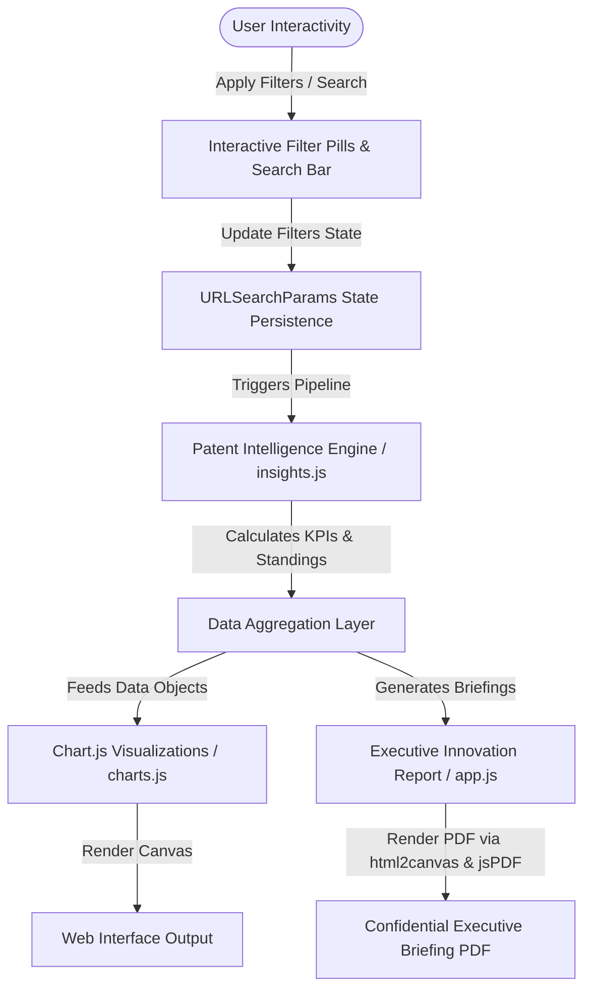

# Global Patent Intelligence Dashboard

[](https://patent-intelligence-dashboard.vercel.app/)
[](https://opensource.org/licenses/MIT)
[](https://html.spec.whatwg.org/)
[](https://www.w3.org/Style/CSS/)
[](https://www.chartjs.org/)

**🔗 Live Demo:** [https://patent-intelligence-dashboard.vercel.app/](https://patent-intelligence-dashboard.vercel.app/)

A high-performance, enterprise-grade innovation analytics dashboard inspired by **WIPO, OECD, USPTO,** and **World Bank** data explorer portals. This platform delivers deep analytical insights into global patenting trends, geographic distributions, organizational performance, and technological specializations from 2015 to 2025.

---

## 🖥️ Dashboard Preview

This repository contains design mockups and structured areas for capturing interactive dashboard screenshots. To update these, replace the placeholders with PNG captures:

* **Executive Overview**: *[Capture the main tab containing 8 animated KPI counters, the Patent Intelligence Engine bulletin card, and the filing trend charts.]*
  * *Path*: `assets/previews/executive_overview.png`
* **Strategic Positioning Matrix**: *[Capture the McKinsey quadrant bubble chart under the Applicant Intel tab mapping organizational filings by volume and average citation impact.]*
  * *Path*: `assets/previews/strategic_matrix.png`
* **Country Comparison**: *[Capture the Geographic Intel tab in comparison mode showing side-by-side metrics and filing trajectory curves.]*
  * *Path*: `assets/previews/country_comparison.png`
* **Executive Report Generator**: *[Capture the modal overlay containing the print-ready, one-page WIPO innovation briefing.]*
  * *Path*: `assets/previews/executive_report.png`

---

## 🚀 Key Features

* **Interactive Executive Dashboard**: 8 animated KPI metrics (counters) and a rule-based **Patent Intelligence Engine** summarizing current vectors.
* **5 Dedicated Intelligence Views**:
  1. **Executive Overview**: High-level trends, national shares, lifecycles, and main applicants.
  2. **Innovation Trends**: Multi-dimensional growth models and YoY rates.
  3. **Geographic Intelligence**: National citation index scores and sorted table matrices.
  4. **Applicant Intelligence**: Dynamic innovator leaderboard featuring custom **WIPO Innovation Scores**.
  5. **Technology Intelligence**: IPC code frequencies, domain comparison radar plots, and strength/weakness indices.
* **Advanced Controls & Interactions**:
  * Cross-filtering: Filter by Country, Applicant, Technology Domain, and Patent Status.
  * Year range slider constraints.
  * Debounced global search across ID, Applicant, Domain, IPC, and Country.
* **Enterprise Reporting Exports**:
  * Save individual charts as high-resolution PNGs.
  * Export the active filtered dataset directly to CSV.
  * Export the entire dashboard view into a formatted PDF document.
* **Responsive Dark / Light Themes**: Adaptive visualization palettes with persisted state via localStorage.
* **Resilient Architecture**: Fallback mock generator that runs client-side if file-protocol CORS limits block fetch requests.

---

## 🏛️ Architecture

The application is built as a pure client-side decoupled application, allowing for instantaneous client-side filtering, data calculations, and rendering.



---

## 💼 Business Value

This dashboard provides critical decision support for multiple strategic stakeholders:

* **Innovation Analysts**: Evaluate filing volumes and YoY growth models to detect early signs of tech sector expansions (e.g., the rapid surge of Generative AI post-2020).
* **Policy Researchers**: Compare national specialization metrics and filing volumes to analyze the relative positioning of global research leaders.
* **Intellectual Property Professionals**: Run applicant comparisons and track citation index rankings to assess competitor portfolio quality and licensing opportunities.
* **Technology Strategists**: Apply multi-criteria search filters to discover emerging technology domains, monitor key innovators, and assess regional distribution shifts.

### Core Use Cases:
1. **Tracking Innovation Activity**: Observe filing trajectories and YoY acceleration to benchmark innovation momentum.
2. **Comparing Countries**: Side-by-side analysis of patent volume, citation index scores, and domain specialization.
3. **Monitoring Applicant Performance**: Rank players using WIPO Innovation Scores combining volume, impact, and diversity.
4. **Identifying Emerging Technologies**: Track IPC class distributions and domain trends.
5. **Evaluating Citation Impact**: Leverage the McKinsey Strategic Matrix to separate volumetric filers from high-impact niche pioneers.

---

## 📊 Patent Intelligence Dataset

The system includes a pre-generated, realistic dataset of **2,250 patent records** stored in `data/patents.json`.
* **Field Structure**:
  ```json
  {
    "patent_id": "US20150001",
    "filing_year": 2023,
    "country": "United States",
    "applicant": "Google",
    "technology_domain": "Generative AI",
    "ipc_category": "G06N",
    "citation_count": 45,
    "patent_status": "Granted"
  }
  ```
* **Distribution Properties**:
  * **Generative AI** filings display an exponential surge post-2020.
  * **United States** and **China** dominate total filing volume (approx. 68% combined).
  * **IBM** exhibits lower patent volume but high citation averages, representing pioneering breakthrough patents.
  * **OpenAI** and **NVIDIA** display high citation averages concentrated in Generative AI since 2020.

---

## 🛠️ Technology Stack

* **Structure**: HTML5 Semantic Architecture
* **Styling**: Vanilla CSS3 (Custom Grid layouts, CSS Variables, Glassmorphism, animations)
* **Visualization Engine**: [Chart.js (v4.x)](https://www.chartjs.org/)
* **Exporting Tools**: [html2canvas (v1.4)](https://github.com/niklasvh/html2canvas), [jsPDF (v2.5)](https://github.com/parallax/jsPDF)
* **Icons**: FontAwesome 6

---

## 📈 Key Metrics & Calculations

### Innovation Score
To rank applicants objectively, the platform implements a standardized multi-criteria index:
$$\text{Innovation Score} = (0.5 \times \text{Patent Count}) + (0.3 \times \text{Average Citations}) + (0.2 \times \text{Domain Diversity})$$
* **Patent Count**: Volumetric measure of research capability.
* **Average Citations**: Direct quality impact indicator.
* **Domain Diversity**: Unique count of technology domains (1 to 10), reflecting cross-sector adaptability.

---

## ⚙️ How to Run Locally

### Option 1: Double-Click (Local File System)
Simply double-click `index.html`. The dashboard will detect the local environment and launch the in-memory fallback dataset generator seamlessly.

### Option 2: Live HTTP Server (Bypasses Browser CORS limits)
To load the pre-generated static `data/patents.json` dataset:
1. Run a local python server in the folder:
   ```bash
   python -m http.server 8000
   ```
2. Navigate to:
   ```text
   http://localhost:8000
   ```

---

## 🔮 Future Improvements

1. **Active NLP Patent Parsing**: Integrate client-side tokenizers to pull TF-IDF keywords from patent descriptions dynamically.
2. **Co-citation Networks**: Introduce interactive D3.js force-directed nodes showing citation linkages.
3. **Integration with WIPO PATENTSCOPE**: Link direct patent lookups to official WIPO records.
4. **Integration with Google Patents & USPTO**: Enable API-driven imports of verified global patent filings.
5. **Real-time Patent Intelligence Feeds**: Wire background polling to fetch newly published research files.
6. **Advanced Citation Network Analysis**: Track parent-child forward/backward citation paths across applicant boundaries.
